  <h3><code>s0pex@github ~ $ ./contributions.sh</code></h3>
  
    
  <h3><code>s0pex@github ~ $ whoami</code></h3>
  
   
  "Code is like humor. When you have to explain it, it's bad." - Cory House

 

Backend and infrastructure developer. I work on distributed systems, cloud infrastructure and CI/CD.

 

<h3><code>s0pex@github ~ $ cat experience.md</code></h3>

  

<h3><code>s0pex@github ~ $ cat stack.md</code></h3>

  

<h3><code>s0pex@github ~ $ cat education.md</code></h3>

<h3><code>s0pex@github ~ $ ./away-from-keyboard.sh</code></h3>

<!-- plain-text:start -->

Plain text version

#### Experience

**Senior Software Developer**, Infolytics AG (2026 to present)

- Technical owner of three business domains of a live public-sector platform (Spring Boot, Angular, OpenShift) where applications are submitted and processed by caseworkers
- End-to-end responsibility for these domains: architecture, delivery, operations and direct customer contact
- Still active on SDF, the Infolytics signal data platform: feature development and consulting
- Mentor junior developers and working students

**Software Developer**, Infolytics AG (2022 to 2026)

- Continued developing SDF alongside new responsibilities
- Led the migration of the SDF frontend applications from jQuery to Angular, and of the backend from MaxDB to PostgreSQL including all existing data, with no downtime
- Tracked down hard production issues (memory leaks, network protocol bugs) and shipped the fixes
- Replaced manual deploys with GitOps on Kubernetes and Argo CD

**Working Student**, Infolytics AG (2018 to 2022)

- Developed the Java client library for the native TCP protocol of SDF, the signal data platform behind WiValdi<b>*</b>, a DLR wind research project with 2,000+ sensors. Also worked on the C++ backend
- Other Java projects: optimization and maintenance
- Hired full-time right after the B.Sc.

<b>*</b> WiValdi (also called DFWind) is a DLR research project. I worked on SDF, the Infolytics signal data platform it runs on, not on WiValdi itself.

#### Stack

- **Languages:** Java, C#, TypeScript, C++, Python
- **Frameworks:** Spring Boot, ASP.NET Core, NestJS, Angular, React, Next.js
- **Infrastructure:** Kubernetes, OpenShift, Docker, Helm, Argo CD, Proxmox VE, Ansible, GitLab CI, GitHub Actions
- **Cloud:** Google Compute Engine, Oracle Cloud Infrastructure
- **Data:** PostgreSQL, MySQL, MariaDB, JPA, Hibernate, Entity Framework, Drizzle

#### Education

**M.Sc. Computer Science, with honors**, University of Cologne (2023 to 2026)

- Focus areas: Software-Intensive Systems and High-Performance Computing
- Master thesis at the German Aerospace Center (DLR), Distributed Software Systems group: "A Unifying Framework for Provisioning and Executing Computational Tools across Heterogeneous Computing Environments"
  - Designed a coordinator-worker architecture and implemented a prototype that unifies tool execution across heterogeneous computing environments (Kubernetes, Slurm, native Linux, Windows) behind a single REST API<b>*</b>
  - In production use at DLR, open source release planned
- Member of the faculty selection committee

**B.Sc. Computer Science**, RWTH Aachen University (2018 to 2022)

- Minor in Business Administration
- Bachelor thesis at Fraunhofer IPT: "Development and Deployment of a Cloud-Based System Architecture for Domain-Specific AutoML Systems"
  - Migrated an AutoML pipeline to Kubernetes (Oracle OKE) and built a cloud-native architecture with a NestJS backend and ReactJS frontend

**IT Assistant with A-levels**, Georg-Simon-Ohm-Berufskolleg (2015 to 2018)

- School-based vocational training in Germany (schulische Ausbildung) in programming, networking and more, completed together with the Abitur (German A-levels)

<b>*</b> Tools are described in a declarative YAML specification (name, version, typed inputs and outputs, runtime). Workers parse it and register their tools with the central coordinator. Its REST API lists the registered tools and accepts jobs with binary or primitive inputs. Each job is scheduled onto a suitable worker, which stages the artifacts, executes the task and uploads the results. Failed jobs are retried, and users follow job progress through real-time events instead of polling.

<!-- plain-text:end -->
