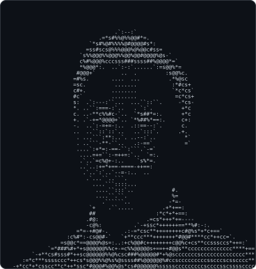

  <h3><code>s0pex@github ~ $ ./contributions.sh</code></h3>
  
    
  <h3><code>s0pex@github ~ $ whoami</code></h3>
  <table>
    <tr>
      <td valign="top"></td>
      <td valign="top"></td>
    </tr>
  </table>

 

Backend and infrastructure developer. I work on distributed systems, cloud infrastructure and CI/CD.

 

### Experience

| Role                          | Where         | Period              | What I do                                                                                                                                                                                                                                                                                                                                                                                                                                    |
| :---------------------------- | :------------ | :------------------ | :------------------------------------------------------------------------------------------------------------------------------------------------------------------------------------------------------------------------------------------------------------------------------------------------------------------------------------------------------------------------------------------------------------------------------------------- |
| **Senior Software Developer** | Infolytics AG | Apr 2026 - today    | <ul><li>Technical owner of three domains of a running public-sector platform (Spring Boot, Angular, OpenShift) where applications are submitted and processed by caseworkers</li><li>End-to-end responsibility for them: architecture, delivery, operations and direct customer contact</li><li>Still active on SDF: feature development and consulting</li><li>Mentor junior developers and working students</li></ul>                      |
| **Software Developer**        | Infolytics AG | Oct 2022 - Mar 2026 | <ul><li>Kept developing SDF with more responsibility</li><li>Led the migration of the SDF frontend applications from jQuery to Angular, and of the backend from MaxDB to PostgreSQL including all existing data, with no downtime</li><li>Debugged hard production issues down to protocol level (memory leaks, network protocol bugs) and shipped the fixes</li><li>Replaced manual deploys with GitOps on Kubernetes and Argo CD</li></ul> |
| **Working Student**           | Infolytics AG | Oct 2018 - Sep 2022 | <ul><li>Developed the Java client library implementing the native TCP protocol of SDF, the signal data platform behind WiValdi*, a 2,000+ sensor wind research project with DLR. Also worked on the C++ backend</li><li>Other Java projects: optimization and housekeeping</li></ul>                                                                                                                                                         |

\* WiValdi (also called DFWind) is a DLR research project. Infolytics develops SDF, the signal data platform it runs on, and that is the part I worked on.

### Education

| Degree                                             | School                                                            | Notes                                                                                                                                      |
| :------------------------------------------------- | :---------------------------------------------------------------- | :----------------------------------------------------------------------------------------------------------------------------------------- |
| **M.Sc. Computer Science** (Dec 2025, with honors) | University of Cologne                                             | Software-Intensive Systems and High-Performance Computing. Member of the faculty selection committee.                                      |
| &emsp;└ Master Thesis                              | German Aerospace Center (DLR), Distributed Software Systems group |                                                                                                                                            |
| **B.Sc. Computer Science** (2022)                  | RWTH Aachen University                                            | Thesis on cloud-based architecture for domain-specific AutoML. Minor in Business Administration.                                           |
| &emsp;└ Bachelor Thesis                            | Fraunhofer IPT                                                    | Moved an AutoML pipeline onto Kubernetes (Oracle OKE) with a NestJS backend and ReactJS frontend. Stack: TypeScript, Python, Podman, Argo. |
| **IT Assistant**                                   | Georg-Simon-Ohm-Berufskolleg                                      | Application development and network administration.                                                                                        |

### Stack

|                    |                                                                          |
| :----------------- | :----------------------------------------------------------------------- |
| **Languages**      | Java, C#, TypeScript, C++, Python                                        |
| &emsp;└ Frameworks | Spring Boot, ASP.NET Core, NestJS, Angular, React, Next.js               |
| **Infrastructure** | Kubernetes, Docker, Proxmox VE, Ansible, GitLab CI, GitHub Actions       |
| &emsp;└ Cloud      | Google Compute Engine, Oracle Cloud Infrastructure                       |
| **Data**           | PostgreSQL, MySQL, MariaDB via JPA, Hibernate, Entity Framework, Drizzle |

  

### Away from the keyboard

Badminton, bouldering and being outdoors.

"Code is like humor. When you have to explain it, it's bad." - Cory House
